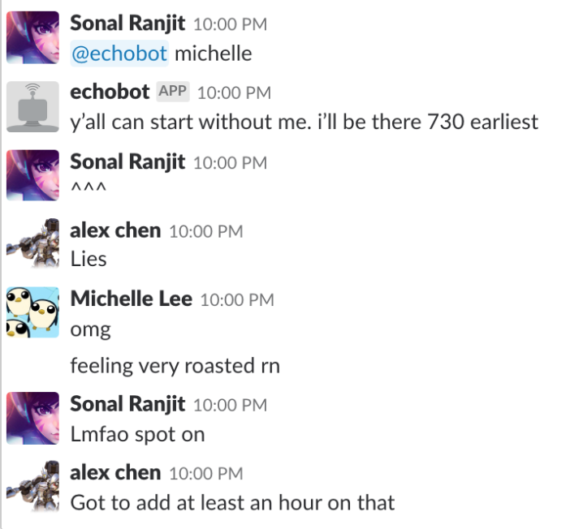

# Echobot

The nocontext slackbot you've been waiting for.

Type `@echobot <NAME>` and echobot will repeat several random phrases that person has said on Slack in the past.

<i>[Roasted by my own creation]</i>

## Installation

1. Get an API token from Slack.

2. Create a bot user on your Slack group -- see [link here](https://api.slack.com/bot-users).

3. Just run `go build` and `go run slackbot.go`. Enjoy!

## Other

It will also download as JSON the following data:

- All the channels within the group
- All user IDs within the group
- All Slack channel IDs
